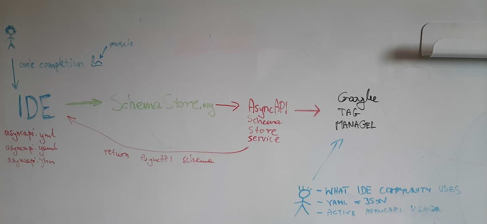

# AsyncAPI Schema Store

Deno app that stores AsyncAPI schema and sends info to Google Analytics on each
download request. The purpose is to enable us to track adoption of AsyncAPI
specification.

Message-driven APIs, in most use cases, are private. Communication occures
internally between microservices or IoT devices. Some exceptions are WebSocket
APIs or platforms that allow integratio through events. This is the reason not
many people publicly share their use cases. It is hard to measure adoption rate.
We know the community grows but do not have a real numbers that cover how many
withe the AsyncAPI documents.

The idea is to track spec usage through the IDE's that users use. When user
edits AsyncAPI file, the IDE tries to download the JSON Schema for the file to
enable inline validation. How does IDE know where to find it?

- User either explicitly configures that in the IDE:
      ```yaml
      #example for VSCode using YAML plugin from RedHat
          "yaml.schemas": {
              "URL_TO_JSON_SCHEMA":"asyncapi*" # "asyncapi*" means any file that starts with `asyncapi` will be covered
          }
      ```
- The JSON Schema is stored on
  [JSON Schema Store](https://www.schemastore.org/json/) that most IDEs
  integrate with. IDE automatically fetch a schema that matches the pattern of
  your file. Below you see an example of entry in the store for GitHub Actions
  JSON Schema:
      ```json
      {
        "name": "GitHub Action",
        "description": "YAML schema for GitHub Actions",
        "fileMatch": [
          "action.yml",
          "action.yaml"
        ],
        "url": "https://json.schemastore.org/github-action.json"
      }
      ```

Instead of hosting the schema on https://json.schemastore.org or GitHub
releases. We should host it on a custom server that serves these schemas and on
each fetch request, notes done that there is a new user playing with AsyncAPI
:rocket:


